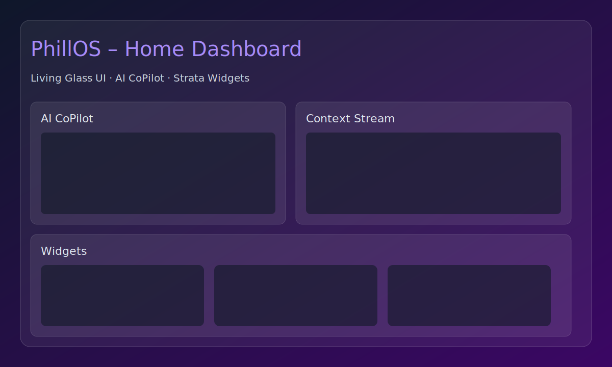

# ✨ PhillOS — Living Glass AI‑Native OS (Advanced README)

PhillOS is an AI‑native OS concept that blurs the line between interface and intelligence. It combines a translucent “Living Glass” UI with proactive agents, on‑device AI, and a modular app suite.

This README goes beyond a quick intro: it is the source of truth for architecture, local setup, production builds, app ecosystem, AI configuration, privacy, performance tuning, and advanced guides.

---

## Table of Contents
- Overview
- Key Capabilities
- Screenshots
- Live Demo (Local)
- Architecture
- Frontend (UI Shell)
- Agents & Services
- App Ecosystem
- AI Providers & Config
- Local Models via Ollama
- Data, Privacy & Security
- Performance & Bundling
- Building, Testing & QA
- Dev Environment
- Troubleshooting
- Roadmap
- License

---

## Overview
PhillOS envisions the OS as an intelligent, context‑aware companion. The UI, services, and agents are deeply integrated, enabling:
- Proactive assistance (anticipatory suggestions, auto‑organization)
- Adaptive, fluid UI (Living Glass) that feels tactile and alive
- Local‑first AI with optional cloud augmentation
- Modular apps for files, vision, media, research, and more

---

## Key Capabilities
- Living Glass UI shell with Status Bar, Dock, mobile nav, and Strata widgets
- AI CoPilot with streaming responses and voice (browser STT or Whisper)
- Conversational Settings that execute system intents via natural language
- Local Qwen via Ollama, plus optional OpenAI/Gemini cloud providers
- PWA with offline caching and static assets
- Tauri integration stubs for desktop-native features (Vault)

---

## Screenshots
- Home Dashboard: `docs/screenshots/ui-home.svg`
- AI CoPilot: `docs/screenshots/copilot.svg`
- Settings: `docs/screenshots/settings.svg`
- Vault (Files): `docs/screenshots/vault.svg`
- WebLens: `docs/screenshots/weblens.svg`

---

## Live Demo (Local)
- Dev server: `npm run dev` then open the printed URL.
- Production preview: `npm run build && npm run preview`.
- Tauri (desktop shell): refer to `src-tauri/` and Tauri docs.

---

## Architecture
- UI: React 19 + TypeScript + Tailwind + Vite
- PWA: `vite-plugin-pwa` with runtime caching for app APIs
- App modules under `src/apps/*` loaded directly into the shell
- Services: `services/*` host agent logic, data orchestration, AI backends
- Backend: `backend/server.js` for demo endpoints (Express)
- Cross‑lang test stubs: JS/Vitest, Go, Rust (Tauri), Python (tools)

High‑level flow:
1) UI captures intent (chat, settings, actions)
2) Agents/services interpret and route intents
3) AI providers (local/cloud) fulfill tasks
4) UI presents results, with context updates and persistence

---

## Frontend (UI Shell)
- `src/App.tsx` routes and renders core shell + apps
- `src/components/*` includes StatusBar, Dock, Widgets, etc.
- `src/contexts/*` share theme, auth, storage, memory hub
- Cursor customization via theme settings; SVG cursors under `src/assets/cursors`

Styling: Tailwind and utility classes for glassmorphism:
- backdrop-blur, low‑opacity panels, subtle borders, inner shadows
- Responsive breakpoints ensure a coherent mobile/desktop experience

---

## Agents & Services
Location: `services/*`
- `agentOrchestrator.ts` and `agentService.ts`: register and execute actions
- `settingsCommandService.ts`: parses natural language settings intents
- `modelManager.ts`: orchestrates AI sessions (local/cloud) and workers
- `weblensResearchService.ts`, `visionVaultService.ts`, `mediaSphereService.ts`: domain‑specific logic
- `whisperService.ts`: optional Whisper transcription via Python (lazy‑loaded)

Event & memory:
- `memoryService.ts` and `memoryHubService.ts` store UI/agent conversations
- `streamBus.ts` and `contextBus.ts` enable pub/sub style updates

---

## App Ecosystem
- Vault: file navigation, tagging (SmartTags), auto‑cleanup suggestions
- WebLens: article summarization, citations, tracker scanning
- MediaSphere: media analysis, local scene detection wasm (placeholder)
- SoundScape: mood playlists, live audio insights, adaptive EQ
- VisionVault: image tagging, search, optional AR preview
- SecureCore: threat score, firewall toggle, quick scan
- AppForge: app recommendations, system pulse hooks
- BrainPad: note capture, live summaries, voice dictation
- TimeAI, GenLab, ConverseAI: productivity and model experiments
- Settings: conversational + categorized settings

Each app lives under `src/apps/<app-name>` with an `index.ts` exporting a default component.

---

## AI Providers & Config
- Cloud: OpenAI or Google Gemini. Provide key in the UI when requested.
- Local: Qwen3 via Ollama for on‑device chat. Default model `qwen3:1.7b`.

Environment variables (build‑time):
- `VITE_LOCAL_AI_MODEL` – override Ollama model tag
- `VITE_TRAINING_ENABLED` – enable/disable local training
- `VITE_TRAINING_FREQUENCY_MS` – training cadence

See `docs/ai_providers.md` for details.

---

## Local Models via Ollama
- Install Ollama for your platform, run `ollama serve`
- App will reach `http://localhost:11434` by default
- Switch between local/cloud in onboarding or settings

---

## Data, Privacy & Security
- Local‑first: preferences and lightweight memory use `localStorage`
- Cloud keys are entered in-session and not persisted by default
- Optional Whisper transcription runs locally via Python process
- SecureCore simulates a security posture (threat score, scans)

This prototype is for research; audit before production use.

---

## Performance & Bundling
- Vite manualChunks splits vendors: React, Lucide, AI SDKs
- PWA runtime caching for API routes and phone bridge
- Heavy modules are lazy‑loaded where sensible (e.g., Whisper service)
- Use `npm run build` for optimized bundles in `dist/`

---

## Building, Testing & QA
Commands:
- Dev: `npm run dev`
- Build: `npm run build`
- Preview: `npm run preview`
- Lint: `npm run lint`
- Tests (multistack): `npm test` (JS vitest + Go + Rust + Python)

Artifacts:
- Frontend bundle: `dist/`
- Service worker: `dist/sw.js`

---

## Dev Environment
- Node 18+ recommended
- Install: `npm ci`
- IDE: TypeScript + ESLint + Tailwind intellisense
- Optional: Tauri toolchain for desktop (Rust + Cargo)

---

## Troubleshooting
- Build fails on Node modules (fs/path/child_process): ensure those services are lazy‑loaded or not imported in the browser tree
- Whisper not available: install Python3; set `WHISPER_PYTHON` if needed
- Ollama errors: ensure `ollama serve` is running and model is pulled
- PWA caching: clear application storage if stale assets persist

---

## Roadmap
- Deeper agent workflows across apps
- Robust data privacy controls and sandboxing
- First‑class mobile container and Android bridge
- App store & permissions
- Richer 3D/AR surfaces for Living Glass

---

## License
MIT. See `LICENSE`.
